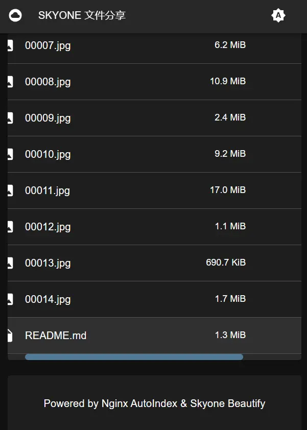

## Nginx AutoIndex 美化

基于 React & MUI 的 Nginx AutoIndex 美化，完美支持GitHub Markdown语法，用了都说好！

[[demo](https://autoindex.demo.skyone.host)] 小水管，第一次打开速度慢...

`React` + `MUI` + `Remark` + `MathJax`


已完成：

1. [x] 很好看（大概）
2. [x] 适配手机等窄设备
3. [x] 按文件名、大小、修改时间排序
4. [x] 简单自定义
5. [x] 暗色模式 & 跟随系统模式
6. [x] README.md & gfm
7. [x] 数学公式、代码高亮

计划：

1. [ ] 使用 `react-router`
2. [ ] README 支持折叠
3. [ ] 欢迎 issue

有人用才有动力更新呐~

~~作者很懒，代码基本怎么直接怎么写，欢迎修改~~

~~`FileTable.tsx` 写的很烂，别问，问就是懒，不想动脑子~~

## 部署教程

从 Releases 下载最新版 `nginx-autoindex.zip` ，解压到一个任意目录（例如 `/path/to/file` ）

```
/path/to/file
├─nginx-autoindex
│ ├─app.js
│ ├─xxx.js
│ └─xxx.css
└─autoindex.html
```

编辑文件 `/path/to/file/autoindex.html` ，按需修改

```html
<script>
    window.siteConfig = {
        name: "文件分享",      // 标题，默认为 `文件分享`
        title: undefined,     // 浏览器标题栏显示的标题，默认与 `name` 相同
        footer: "Powered by Nginx AutoIndex & Skyone Beautify", // 最底部的说明
        readme: true,         // 是否启用 README.md , 需要 766KB , gzip 压缩后约 220KB
                              // 异步加载, 不会堵塞主界面, 还有不错地加载动画
                              // 还可以选择配置用于渲染 markdown 的服务器的 URL
                              // 例如: "https://example.com/markdown/render"
                              // 个人感觉没必要, 220KB 已经足够小了
        before: true          // README.md 显示在文件列表前面还是后面
    }
</script>
<script src="/nginx-autoindex/app.js"></script>
<link href="/nginx-autoindex/app.css" rel="stylesheet">
```

编辑 Nginx 配置文件，模板如下：

```nginx
server {
    listen 80;                    # 监听的端口
    server_name www.skyone.host;  # 你的域名

    location = /autoindex.html {
        root   /path/to/file;     # 记得改
    }

    location ~ ^/nginx-autoindex/ {
        root   /path/to/file;     # 记得改
    }

    location / {
        root /var/www;            # 你文件的位置
        autoindex on;
        add_after_body /autoindex.html;
    }
}
```

## 更多截图


|                                             |                                            |
|---------------------------------------------|--------------------------------------------|
|  |  |
